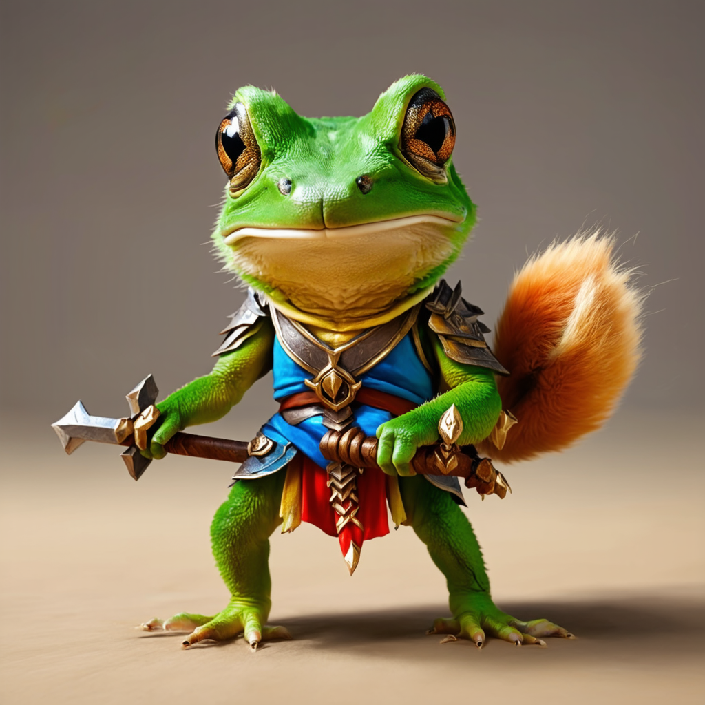
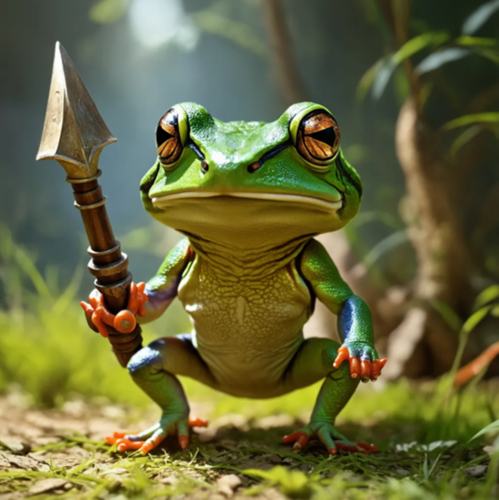

## Rare-to-Frequent: Unlocking Compositional Generation Power of Diffusion Models on Rare Concepts with LLM Guidance, [PDF](url_todo)

by [Dongmin Park](https://scholar.google.com/citations?user=4xXYQl0AAAAJ&hl=ko)<sup>1</sup>, [Sebin Kim](https://kr.linkedin.com/in/sebin-kim-25b826283/en)<sup>2</sup>, [Taehong Moon](https://scholar.google.co.kr/citations?user=wBwIIYQAAAAJ&hl=ko)<sup>1</sup>, [Minkyu Kim](https://scholar.google.com/citations?user=f-kVmJwAAAAJ&hl=ko)<sup>1</sup>, [Kangwook Lee](https://scholar.google.co.kr/citations?user=sCEl8r-n5VEC&hl=ko)<sup>1</sup>, [Jaewoong Cho](https://sites.google.com/view/jaewoongcho)<sup>1</sup>.

<sup>1</sup> KRAFTON, <sup>2</sup> Seoul National University, <sup>3</sup> University of Wisconsin-Madison


## 🔎Overview
- **Rare-to-frequent (R2F)** is a powerful training-free framework that can **unlock** the compositional generation power of SOTA text-to-image diffusion models (e.g., SDXL or SD3) on rare concept prompts by leveraging SOTA LLMs (e.g., GPT-4o or LLaMA3) as the **rare concept identificator** and **frequent concept guider** throughout the diffusion sampling steps
- R2F is **flexible** to arbitrary combination of diffusion backbones and LLM architectures
- R2F can also be **seamlessly integrated with region-guided diffusion** approaches, yielding more controllable image synthesis
  - First work to apply cross-attention control on SD3!!!

## 🖼Examples
- While SOTA pre-trained T2I models (e.g., SD3 and FLUX) and an LLM-grounded T2I approach (e.g., RPG) struggle to generate images from prompts with **rare compositions of concepts** (= *attribute* + *object* ), R2F exhibits superior generation results
- This may provide a better image generation experience for user creators (e.g., designing a new character with unprecedented attributes)

<table class="center">
  <tr>
    <td width=25% style="border: none" > <b> R2F (Ours) </b> </td>
    <td width=25% style="border: none">FLUX-schnell</td>
    <td width=25% style="border: none">SD3</td>
    <td width=25% style="border: none">RPG</td>
  </tr>
  <tr>
    <td width=25% style="border: none"></td>
    <td width=25% style="border: none"></td>
    <td width=25% style="border: none"></td>
    <td width=25% style="border: none"></td>
  </tr>
  <tr>
    <td colspan="4" style="border: none; text-align: center; word-wrap: break-word">Prompt: A furry frog warrior</td>
  </tr>
  <tr>
    <td width=25% style="border: none"></td>
    <td width=25% style="border: none"></td>
    <td width=25% style="border: none"></td>
    <td width=25% style="border: none"></td>
  </tr>
  <tr>
    <td colspan="4" style="border: none; text-align: center; word-wrap: break-word">Prompt: A mustachioed squirrel is holding an ax-shaped guitar on a stage</td>
  </tr>
  <tr>
    <td width=25% style="border: none"></td>
    <td width=25% style="border: none"></td>
    <td width=25% style="border: none"></td>
    <td width=25% style="border: none"></td>
  </tr>
  <tr>
    <td colspan="4" style="border: none; text-align: center; word-wrap: break-word">Prompt: A beautiful wigged octopus is juggling three star-shaped apples</td>
  </tr>
  <tr>
    <td width=25% style="border: none"></td>
    <td width=25% style="border: none"></td>
    <td width=25% style="border: none"></td>
    <td width=25% style="border: none"></td>
  </tr>
  <tr>
    <td colspan="4" style="border: none; text-align: center; word-wrap: break-word">Prompt: A red dragon and a unicorn made of diamond rollerblading through a neon lit cityscape</td>
  </tr>
</table>


## 🧪How to Run

#### 1. Quick Start; R2F with SD3 and GPT-4o
```python
from RegionalDiffusion_base import RegionalDiffusionPipeline
from RegionalDiffusion_xl import RegionalDiffusionXLPipeline
from diffusers.schedulers import KarrasDiffusionSchedulers,DPMSolverMultistepScheduler
from mllm import local_llm,GPT4
import torch
# If you want to load ckpt, initialize with ".from_single_file".
pipe = RegionalDiffusionXLPipeline.from_single_file("path to your ckpt",torch_dtype=torch.float16, use_safetensors=True, variant="fp16")
# If you want to use diffusers, initialize with ".from_pretrained".
# pipe = RegionalDiffusionXLPipeline.from_pretrained("path to your diffusers",torch_dtype=torch.float16, use_safetensors=True, variant="fp16")
pipe.to("cuda")
pipe.scheduler = DPMSolverMultistepScheduler.from_config(pipe.scheduler.config,use_karras_sigmas=True)
pipe.enable_xformers_memory_efficient_attention()
## User input
prompt= ' A handsome young man with blonde curly hair and black suit  with a black twintail girl in red cheongsam in the bar.'
para_dict = GPT4(prompt,key='...Put your api-key here...')
## MLLM based split generation results
split_ratio = para_dict['Final split ratio']
regional_prompt = para_dict['Regional Prompt']
negative_prompt = "" # negative_prompt, 
images = pipe(
    prompt=regional_prompt,
    split_ratio=split_ratio, # The ratio of the regional prompt, the number of prompts is the same as the number of regions
    batch_size = 1, #batch size
    base_ratio = 0.5, # The ratio of the base prompt    
    base_prompt= prompt,       
    num_inference_steps=20, # sampling step
    height = 1024, 
    negative_prompt=negative_prompt, # negative prompt
    width = 1024, 
    seed = None,# random seed
    guidance_scale = 7.0
).images[0]
images.save("test.png")
```

#### 2. Running **R2F** on Benchmark Datasets
```bash
python RPG.py
```

#### 3. Running **R2F+**


## 📝Requirements

**1. Set Environment**

```bash
git clone 
cd Rare-to-Frequent
conda create -n RPG python==3.9
conda activate RPG
pip install -r requirements.txt
```

**2. Set Diffusion Models and LLMs**

TODO


## 📖 Citation
```
TODO
}
```

## Acknowledgements
Our R2F is a general LLM-grounded T2I generation framework, which is built on several solid works. Thanks to [RPG](https://github.com/YangLing0818/RPG-DiffusionMaster), [LMD](https://github.com/TonyLianLong/LLM-groundedDiffusion), [SAM](https://github.com/facebookresearch/segment-anything), and [diffusers](https://github.com/huggingface/diffusers) for their wonderful work and codebase!
