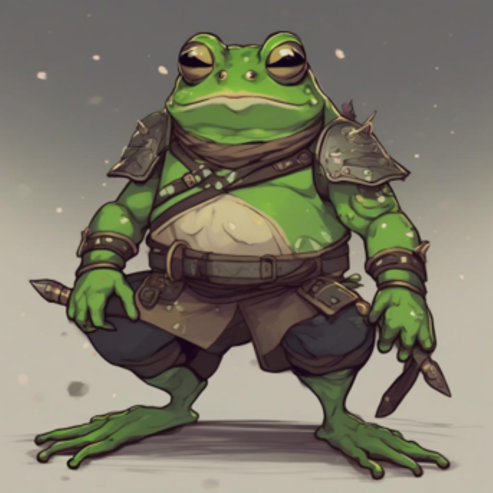

# Rare-to-Frequent: Unlocking Compositional Generation Power of Diffusion Models on Rare Concepts with LLM Guidance, [PDF](https://arxiv.org/pdf/2410.22376)

by [Dongmin Park](https://scholar.google.com/citations?user=4xXYQl0AAAAJ&hl=ko)<sup>1</sup>, [Sebin Kim](https://kr.linkedin.com/in/sebin-kim-25b826283/en)<sup>2</sup>, [Taehong Moon](https://scholar.google.co.kr/citations?user=wBwIIYQAAAAJ&hl=ko)<sup>1</sup>, [Minkyu Kim](https://scholar.google.com/citations?user=f-kVmJwAAAAJ&hl=ko)<sup>1</sup>, [Kangwook Lee](https://scholar.google.co.kr/citations?user=sCEl8r-n5VEC&hl=ko)<sup>1,3</sup>, [Jaewoong Cho](https://sites.google.com/view/jaewoongcho)<sup>1</sup>.

<sup>1</sup> [KRAFTON AI](https://www.krafton.ai/en/research/publications/), <sup>2</sup> Seoul National University, <sup>3</sup> University of Wisconsin-Madison


## 🔎Overview
- **Rare-to-frequent (R2F)** is a powerful training-free framework that can **unlock** the compositional generation power of SOTA text-to-image diffusion models (e.g., SDXL or SD3) by leveraging SOTA LLMs (e.g., GPT-4o or LLaMA3) as the **rare concept identificator** and **frequent concept guider** throughout the diffusion sampling steps
- R2F is **flexible** to an arbitrary combination of diffusion backbones and LLM architectures
- R2F can also be **seamlessly integrated with region-guided diffusion** approaches, yielding more controllable image synthesis
  - First work to apply cross-attention control on SD3!!!


## 🖼Examples
- While SOTA pre-trained T2I models (e.g., SD3 and FLUX) and an LLM-grounded T2I approach (e.g., RPG) struggle to generate images from prompts with **rare compositions of concepts** (= *attribute* + *object* ), **R2F exhibits superior composition results**
- This may provide a better image generation experience for user creators (e.g., designing a new character with unprecedented attributes)

<table class="center">
  <tr>
    <td width=25% style="border: none" > <b> R2F (Ours) </b> </td>
    <td width=25% style="border: none">FLUX-schnell</td>
    <td width=25% style="border: none">SD3</td>
    <td width=25% style="border: none">RPG</td>
  </tr>
  <tr>
    <td width=25% style="border: none"></td>
    <td width=25% style="border: none"></td>
    <td width=25% style="border: none"></td>
    <td width=25% style="border: none"></td>
  </tr>
  <tr>
    <td colspan="4" style="border: none; text-align: center; word-wrap: break-word">Prompt: A <b>furry frog</b> warrior</td>
  </tr>
  <tr>
    <td width=25% style="border: none"></td>
    <td width=25% style="border: none"></td>
    <td width=25% style="border: none"></td>
    <td width=25% style="border: none"></td>
  </tr>
  <tr>
    <td colspan="4" style="border: none; text-align: center; word-wrap: break-word">Prompt: A <b>mustachioed squirrel</b> is holding an <b>ax-shaped guitar</b> on a stage</td>
  </tr>
  <tr>
    <td width=25% style="border: none"></td>
    <td width=25% style="border: none"></td>
    <td width=25% style="border: none"></td>
    <td width=25% style="border: none"></td>
  </tr>
  <tr>
    <td colspan="4" style="border: none; text-align: center; word-wrap: break-word">Prompt: A beautiful <b>wigged octopus</b> is juggling three <b>star-shaped apples</b></td>
  </tr>
  <tr>
    <td width=25% style="border: none"></td>
    <td width=25% style="border: none"></td>
    <td width=25% style="border: none"></td>
    <td width=25% style="border: none"></td>
  </tr>
  <tr>
    <td colspan="4" style="border: none; text-align: center; word-wrap: break-word">Prompt: A red dragon and a <b>unicorn made of diamond</b> rollerblading through a neon lit cityscape</td>
  </tr>
</table>

## 💡Why R2F works?

#### 1. Theoretical observation
<p align="center">
 
</p>

- Once a target **rare** distribution (deep blue) is difficult to estimate by a model, the score-interpolated distribution (sky blue), created through the **interpolation** of the estimated distribution (red) and the **relevant yet frequent** distribution (green), is much **closer** to the actual target.
- In other words, the Wasserstein distance of the score-interpolated distribution (sky blue) to the target (deep blue) is smaller than that of the original estimated distribution (red).

#### 2. Empirical observation
<p align="center">
 
</p>

- Once we generate a rare composition of two concepts (_flower-patterned_ and _animal_), SD3's naive inferences (red line) tend to be inaccurate when the composition becomes rarer (animal classes rarely appear on the LAION dataset).
- However, when we guide the inference with a relatively frequent composition (_flower-patterned bear_, which is easily generated as _bear doll_) at the early sampling steps and then turn back to the original prompt, the generation quality is significantly enhanced (blue line).

Therefore, we can **unlock** the power of diffusion models on rare concepts (even in the tail distribution) !!!


## 🧪How to Run

#### 1. Playground
```python
from R2F_Diffusion_xl import R2FDiffusionXLPipeline
from R2F_Diffusion_sd3 import R2FDiffusion3Pipeline

from diffusers import DPMSolverMultistepScheduler

from gpt.mllm import GPT4_Rare2Frequent
import torch

api_key = "YOUR_API_KEY"

model = "sdxl"
if model == "sdxl":
    pipe = R2FDiffusionXLPipeline.from_pretrained("stabilityai/stable-diffusion-xl-base-1.0",torch_dtype=torch.float16, use_safetensors=True, variant="fp16")
    pipe.scheduler = DPMSolverMultistepScheduler.from_config(pipe.scheduler.config, use_karras_sigmas=True)
elif model == 'sd3':
    pipe = R2FDiffusion3Pipeline.from_pretrained("stabilityai/stable-diffusion-3-medium", revision="refs/pr/26")
pipe.to("cuda")

# Demo
prompt= 'A hairy frog'

# Get r2f prompt from LLMs
r2f_prompt = GPT4_Rare2Frequent(prompt, key=api_key)
print(r2f_prompt)

image = pipe(
    r2f_prompts = r2f_prompt,
    seed = 42,# random seed
).images[0]
image.save(f"{prompt}_test.png")
```

#### 2. Running **R2F** on Benchmark Datasets
```bash
### Get r2f_prompts from GPT-4o/LLaMA
cd gpt
bash get_r2f_response.sh 

### Generate images
cd ../script/
bash inference_r2f.sh
```

#### 3. Running **R2F+** on Benchmark Datasets
```bash
### Get r2fplus_prompts from GPT-4o/LLaMA
cd gpt
bash get_r2fplus_response.sh 

### Generate images
cd ../script/
bash inference_r2fplus.sh
```

## 📊RareBench
- A **new evaluation benchmark** consisting of prompts with diverse and rare concepts
- See [`test/original_prompt/rarebench/`](https://github.com/krafton-ai/rare2frequent/tree/main/test/original_prompt/rarebench) folder.
- All the r2f_prompts generated by GPT-4o are in [`test/r2f_prompt/`](https://github.com/krafton-ai/rare2frequent/tree/main/test/r2f_prompt) folder.

## ✔Set Environment

```bash
git clone 
cd Rare-to-Frequent
conda create -n R2F python==3.9
conda activate r2f
pip install -r requirements.txt
```

## 📖Citation
```
@article{park2024rare,
  title={Rare-to-Frequent: Unlocking Compositional Generation Power of Diffusion Models on Rare Concepts with LLM Guidance},
  author={Park, Dongmin and Kim, Sebin and Moon, Taehong and Kim, Minkyu and Lee, Kangwook and Cho, Jaewoong},
  journal={arXiv preprint arXiv:2410.22376},
  year={2024}
}
```

## Acknowledgements
Our R2F is a general LLM-grounded T2I generation framework built on several solid works. Thanks to [RPG](https://github.com/YangLing0818/RPG-DiffusionMaster), [LMD](https://github.com/TonyLianLong/LLM-groundedDiffusion), [SAM](https://github.com/facebookresearch/segment-anything), and [diffusers](https://github.com/huggingface/diffusers) for their wonderful work and codebase!
